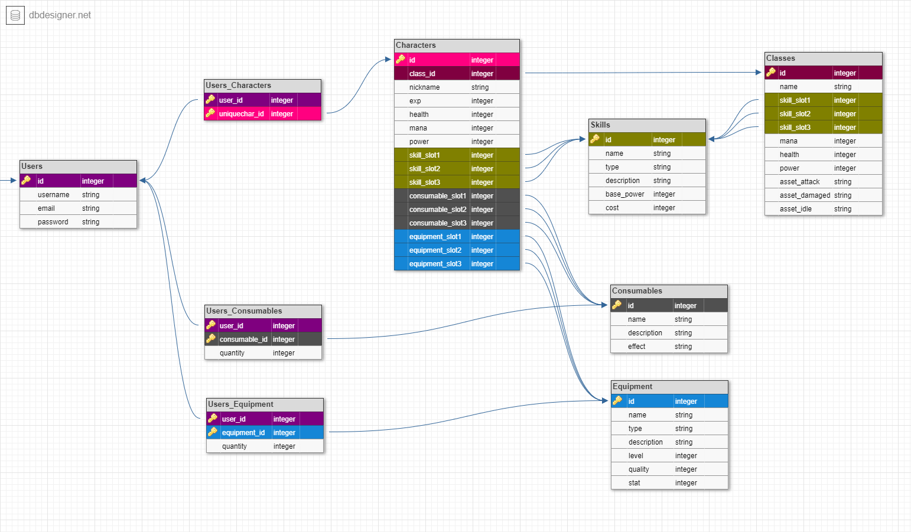

# MINIMAL ARENA API

## API Base URL
LIVE URL: `https://minimal-arena.herokuapp.com/` </br>
STAGING URL: `https://minimal-staging.herokuapp.com/`

#### Server Status
**GET**: `/` </br>
When active, will respond with: 
```
MINIMAL ARENA server is alive
```

## Table of Contents

- [Install](#install)
- [Authentication](#authentication)
    - [Register](#register-a-user) (POST)
    - [Login](#login-with-a-registered-user) (POST)
- [Game](#game)
    - [Classes](#classes) (GET)
    - [Skills](#skills) (GET)
    - [Characters](#characters) (GET)
- [DB Schema](#database-schema)

## Install

```
npm install
```

# Authentication
Authentication expires in: `3 hours`

---
Test Account Seeds:
```
username: Test User
email: test@test.com
password: 1234
```
```
username: Some User
email: user@user.com
password: 1234
```
---

### Register a user

Usernames *MUST* be unique. </br>
Registering an existing user will give a response:
`{ error: "Username already registered" }`</br></br>
**POST**: `/api/auth/register`
```
{
    "username": "myuser",
    "email": "myemail@myemail.com"
    "password": "verysecretpass"
}
```

Will return:
```
{
    "user": {
        "id": int,
        "username": string
    },
    "token": string
}
```

### Login with a registered user
**POST**: `/api/auth/login`
```
{
    "username": "myuser",
    "password": "verysecretpass"
}
```

Will return:
```
{
    "user": {
        "id": int,
        "username": string
    },
    "token": string
}
```

# Game

## Classes
**GET** `/api/game/class`
```
[
    {
        "id": 1,
        "name": "Archer",
        "skill_slot1": {
            "id": 1,
            "name": "Fireball",
            "base_power": 100,
            "type": "magic"
        },
        "skill_slot2": {
            "id": 2,
            "name": "Dagger Slash",
            "base_power": 70,
            "type": "physical"
        },
        "skill_slot3": {
            "id": 3,
            "name": "Spiritual Healing",
            "base_power": 100,
            "type": "magic"
        },
        "mana": 70,
        "health": 80,
        "power": 100
    },
    {
        "id": 2,
        "name": "Warewolf",
        "skill_slot1": {
            "id": 3,
            "name": "Spiritual Healing",
            "base_power": 100,
            "type": "magic"
        },
        "skill_slot2": {
            "id": 1,
            "name": "Fireball",
            "base_power": 100,
            "type": "magic"
        },
        "skill_slot3": {
            "id": 2,
            "name": "Dagger Slash",
            "base_power": 70,
            "type": "physical"
        },
        "mana": 40,
        "health": 130,
        "power": 180
    }
]
```
**GET** `/api/game/class/:id`
```
{
    "id": 1,
    "name": "Archer",
    "skill_slot1": {
        "id": 1,
        "name": "Fireball",
        "base_power": 100,
        "type": "magic"
    },
    "skill_slot2": {
        "id": 2,
        "name": "Dagger Slash",
        "base_power": 70,
        "type": "physical"
    },
    "skill_slot3": {
        "id": 3,
        "name": "Spiritual Healing",
        "base_power": 100,
        "type": "magic"
    },
    "mana": 70,
    "health": 80,
    "power": 100
}
```

## Skills
**GET** `/api/game/skill`
```
[
    {
        "id": 1,
        "name": "Fireball",
        "base_power": 100,
        "type": "magic"
    },
    {
        "id": 2,
        "name": "Dagger Slash",
        "base_power": 70,
        "type": "physical"
    },
    {
        "id": 3,
        "name": "Spiritual Healing",
        "base_power": 100,
        "type": "magic"
    }
]
```

**GET** `/api/game/skill/:id`
```
{
    "id": 1,
    "name": "Fireball",
    "base_power": 100,
    "type": "magic"
}
```
## Characters
Authorization Required: **GET** `/api/game/character`
```
[
    {
        "id": 1,
        "class_id": 1,
        "nickname": "Jeff's Archer",
        "exp": "1000",
        "health": 80,
        "mana": 70,
        "power": 100,
        "skill_slot1": {
            "id": 1,
            "name": "Fireball",
            "base_power": 100,
            "type": "magic"
        },
        "skill_slot2": {
            "id": 2,
            "name": "Dagger Slash",
            "base_power": 70,
            "type": "physical"
        },
        "skill_slot3": {
            "id": 3,
            "name": "Spiritual Healing",
            "base_power": 100,
            "type": "magic"
        },
        "consumable_slot1": 1,
        "consumable_slot2": 2,
        "consumable_slot3": 1,
        "equipment_slot1": 1,
        "equipment_slot2": 2,
        "equipment_slot3": null
    },
    {
        "id": 2,
        "class_id": 2,
        "nickname": null,
        "exp": "0",
        "health": 0,
        "mana": 0,
        "power": 0,
        "skill_slot1": {
            "id": 3,
            "name": "Spiritual Healing",
            "base_power": 100,
            "type": "magic"
        },
        "skill_slot2": {
            "id": 1,
            "name": "Fireball",
            "base_power": 100,
            "type": "magic"
        },
        "skill_slot3": {
            "id": 2,
            "name": "Dagger Slash",
            "base_power": 70,
            "type": "physical"
        },
        "consumable_slot1": null,
        "consumable_slot2": null,
        "consumable_slot3": null,
        "equipment_slot1": null,
        "equipment_slot2": null,
        "equipment_slot3": null
    }
]
```

Authorization Required: **GET** `/api/game/character/:id`
```
{
    "id": 1,
    "class_id": 1,
    "nickname": "Jeff's Archer",
    "exp": "1000",
    "health": 80,
    "mana": 70,
    "power": 100,
    "skill_slot1": {
        "id": 1,
        "name": "Fireball",
        "base_power": 100,
        "type": "magic"
    },
    "skill_slot2": {
        "id": 2,
        "name": "Dagger Slash",
        "base_power": 70,
        "type": "physical"
    },
    "skill_slot3": {
        "id": 3,
        "name": "Spiritual Healing",
        "base_power": 100,
        "type": "magic"
    },
    "consumable_slot1": 1,
    "consumable_slot2": 2,
    "consumable_slot3": 1,
    "equipment_slot1": 1,
    "equipment_slot2": 2,
    "equipment_slot3": null
}
```

Authorization Required: **GET** `/api/game/character/user/:id`
```
[
    {
        "user_id": 1,
        "character_id": 1,
        "id": 1,
        "class_id": 1,
        "nickname": "Jeff's Archer",
        "exp": "1000",
        "health": 80,
        "mana": 70,
        "power": 100,
        "skill_slot1": {
            "id": 1,
            "name": "Fireball",
            "base_power": 100,
            "type": "magic"
        },
        "skill_slot2": {
            "id": 2,
            "name": "Dagger Slash",
            "base_power": 70,
            "type": "physical"
        },
        "skill_slot3": {
            "id": 3,
            "name": "Spiritual Healing",
            "base_power": 100,
            "type": "magic"
        },
        "consumable_slot1": 1,
        "consumable_slot2": 2,
        "consumable_slot3": 1,
        "equipment_slot1": 1,
        "equipment_slot2": 2,
        "equipment_slot3": null
    },
    {
        "user_id": 1,
        "character_id": 2,
        "id": 2,
        "class_id": 2,
        "nickname": null,
        "exp": "0",
        "health": 0,
        "mana": 0,
        "power": 0,
        "skill_slot1": {
            "id": 3,
            "name": "Spiritual Healing",
            "base_power": 100,
            "type": "magic"
        },
        "skill_slot2": {
            "id": 1,
            "name": "Fireball",
            "base_power": 100,
            "type": "magic"
        },
        "skill_slot3": {
            "id": 2,
            "name": "Dagger Slash",
            "base_power": 70,
            "type": "physical"
        },
        "consumable_slot1": null,
        "consumable_slot2": null,
        "consumable_slot3": null,
        "equipment_slot1": null,
        "equipment_slot2": null,
        "equipment_slot3": null
    }
]
```


### Database Schema

